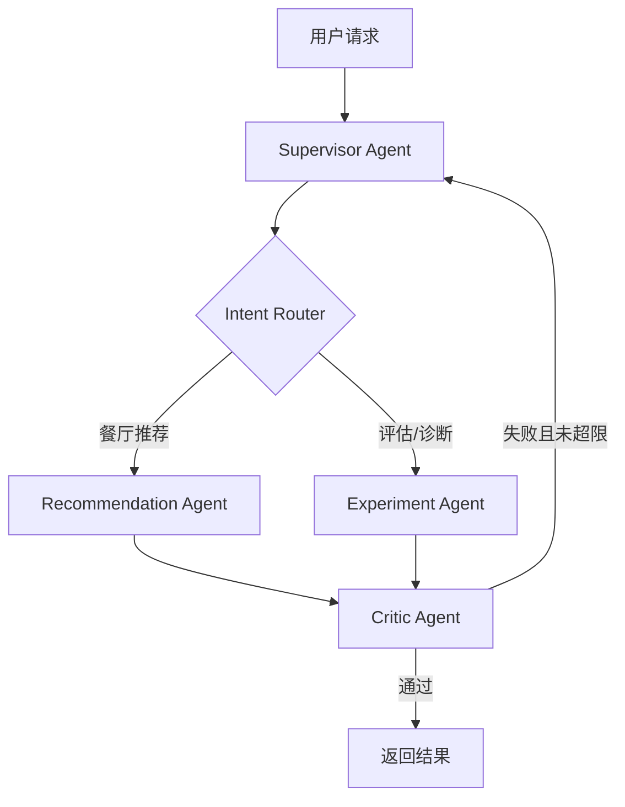

# FoodMate Multi-Agent 架构

## 1. 为什么升级

旧版本虽然有 Planner、Tools、Memory 和 Critic，但所有节点都服务于一次推荐任务，仍偏向固定 workflow。新版本把“用户推荐”和“离线实验诊断”拆成独立专业 Agent，由 Supervisor 动态路由、统一验收和控制重试。

## 2. 总体流程



## 3. Agent 职责

### Supervisor Agent

- 判断请求属于推荐还是实验。
- 生成本轮执行计划并选择专业 Agent。
- 保存共享状态、动作轨迹、延迟和重试次数。
- 根据 Critic 结果决定返回或重新执行。

### Recommendation Agent

- 复用 Stateful RAG 推荐链路。
- 完成偏好抽取、追问、Query Rewrite、Hybrid/BGE 检索、CrossEncoder、业务重排、反馈记忆和解释生成。
- 只负责在线推荐，不负责离线指标分析。

### Experiment Agent

- 从自然语言解析待比较 pipeline 和测试范围。
- 调用现有 evaluation harness，生成 HitRate@5、Precision@5、MRR@5、NDCG@5、约束满足率和延迟。
- 找出质量最佳与延迟最低的 pipeline，并输出诊断建议。

### Critic Agent

- 推荐任务：检查结果非空、关键分数字段齐全，并合并推荐 Agent 自身的约束校验结果。
- 实验任务：检查指标完整、A/B 样本一致、pipeline 可比较。
- 校验失败时把问题返回 Supervisor，最多重试 `FOODMATE_AGENT_MAX_RETRIES` 次。

## 4. 共享状态与 Harness

`MultiAgentState` 保存请求、意图、活动 Agent、计划、偏好、推荐结果、实验指标、Critic 报告、动作和延迟。它让系统从“函数串联”变成可观察、可恢复、可评估的任务运行时。

运行路由评测：

```powershell
python multi_agent_harness.py
```

执行完整推荐任务并统计成功率、步骤数、重试和延迟：

```powershell
python multi_agent_harness.py --full
```

实验 Agent 会加载模型并运行离线 A/B，耗时更长，需要显式开启：

```powershell
python multi_agent_harness.py --full --include-experiments
```

## 5. 使用入口

Streamlit：

```powershell
python -m streamlit run app.py
```

输入餐厅需求会走 Recommendation Agent；输入“比较四种 pipeline 的 MRR 和延迟”会走 Experiment Agent。页面展示 Supervisor 路由、计划、Critic、重试和完整动作轨迹。

FastAPI：

```powershell
python -m uvicorn api:app --reload --port 8000
```

- `POST /recommend`：强制执行推荐任务，兼容原接口。
- `POST /agent`：由 Supervisor 自动判断推荐或实验任务。
- `POST /feedback`：记录用户反馈。

## 6. 这不是简单的线性多 Agent

系统不是固定执行四个 Agent。Supervisor 先判断意图，只调用当前任务需要的专业 Agent；Critic 决定是否结束或重试。后续可继续加入 Data Agent、SQL Agent、Code Agent，而无需修改推荐 Agent 内部逻辑。

当前限制是路由规则仍较轻量，Agent 之间主要共享结构化状态，尚未使用分布式消息队列。数据量和并发扩大后，可将 Experiment Agent 放入 Celery/RQ 异步队列，并把状态迁移到 Redis/PostgreSQL。
