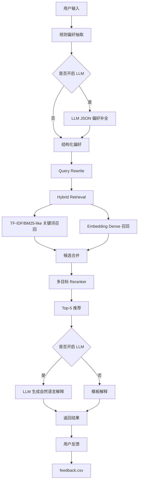

# FoodMate 项目报告

## 1. 项目背景

FoodMate 是一个面向香港中文大学（深圳）周边餐厅场景的 RAG 推荐 Agent。

目标不是简单聊天，而是模拟真实本地生活推荐业务：

- 用户用自然语言表达预算、菜系、距离、场景和优惠偏好。
- 系统从真实餐厅知识库中召回候选。
- 多目标重排序控制推荐结果。
- 推荐解释引用真实餐厅信息。
- 通过离线评估指标衡量效果。
- 通过 API、MCP 和反馈日志支持工程化扩展。

## 2. 系统架构



## 3. 核心模块作用

### 3.1 偏好抽取

文件：

```text
src/agent.py
src/llm.py
```

作用：

- 抽取预算、人均价格、菜系、场景、距离、忌口、优惠偏好。
- 支持规则抽取和 LLM JSON 抽取。
- LLM 只做理解增强，不直接决定推荐结果。

### 3.2 RAG 召回

文件：

```text
src/retriever.py
```

作用：

- 将餐厅信息构造成知识库文档。
- 支持三种检索模式：
  - `tfidf`
  - `embedding`
  - `hybrid`

当前 embedding 是本地 fallback：

```text
TF-IDF -> TruncatedSVD -> dense vector
```

这样即使没有 FAISS/Chroma 依赖，也能跑通 embedding retrieval。

后续可替换为：

```text
bge-small-zh / bge-base-zh / OpenAI embeddings + FAISS/Chroma/Qdrant
```

### 3.3 Hybrid Retrieval

作用：

- 关键词召回适合“工作日套餐”“粤式茶点”“地铁C口”等精确短语。
- Dense embedding 适合理解语义相近表达。
- Hybrid 合并两者，提升召回稳定性。

当前公式：

```text
hybrid_score = 0.55 * tfidf_score + 0.45 * embedding_score
```

### 3.4 多目标重排序

文件：

```text
src/reranker.py
```

作用：

召回只解决“相关”，重排序解决“是否真的适合用户”。

排序特征：

```text
semantic_score
budget_score
distance_score
cuisine_score
scene_score
deal_score
rating_score
dietary_penalty
```

其中 `deal_score` 用于识别：

```text
团购
套餐
工作日午市
下午茶
代金券
```

### 3.5 可解释推荐

文件：

```text
src/agent.py
src/llm.py
```

作用：

- 每家店给出推荐理由、缺点和引用依据。
- 解释必须来自知识库字段。
- 每家店推荐理由限制在 60 字以内。

### 3.6 离线评估

文件：

```text
evaluate.py
data/eval_cases_cuhksz.csv
```

指标：

```text
Hit Rate@5
Precision@5
Recall@5
MRR@5
NDCG@5
Preference Extraction Accuracy
Constraint Satisfaction Rate
Latency
```

### 3.7 A/B 评估

文件：

```text
ab_evaluate.py
```

作用：

比较不同召回策略：

```text
tfidf
embedding
hybrid
```

输出：

```text
reports/ab_evaluation_cuhksz.csv
```

### 3.8 FastAPI 服务

文件：

```text
api.py
```

接口：

```text
GET  /health
POST /recommend
POST /feedback
GET  /feedback
```

作用：

- 将推荐能力服务化。
- Streamlit 之外，也能被前端、移动端或其他系统调用。
- 更接近真实生产架构。

### 3.9 反馈闭环

文件：

```text
src/feedback.py
reports/feedback.csv
```

作用：

记录用户对推荐餐厅的反馈：

```text
喜欢
不喜欢
太贵
太远
不想吃辣
想要优惠
```

后续可以用于：

- 个性化偏好更新
- 排序权重优化
- 训练 Learning-to-Rank 模型

### 3.10 MCP 工具封装

文件：

```text
mcp_server.py
docs/MCP_USAGE.md
```

作用：

将推荐系统能力封装成工具：

```text
extract_preferences
search_restaurants
recommend_restaurants
evaluate_recommender
```

用于展示从本地函数调用迁移到协议化 Agent 工具调用。

## 4. 设计要点

```text
1. RAG 解决餐厅知识更新和事实引用问题。
2. Reranker 解决预算、距离、菜系、优惠等多目标约束。
3. LLM 只做需求理解和解释，不直接决定推荐结果。
4. A/B 评估比较 TF-IDF、Embedding、Hybrid Retrieval。
5. FastAPI + feedback.csv 展示工程化和反馈闭环。
6. MCP server 展示 Agent tool protocol 化能力。
```

## 5. 当前限制

```text
1. embedding 目前是本地 fallback，不是真正的预训练中文 embedding。
2. eval set 虽已扩充到 30 条，但仍是人工构造集。
3. feedback 目前只记录，还没有反向影响排序。
4. FastAPI 需要额外安装 fastapi 和 uvicorn。
5. MCP server 是轻量 stdio JSON-RPC 风格实现。
```

## 6. 后续可扩展方向

```text
1. 接入 bge-small-zh + FAISS/Chroma。
2. 引入 LightGBM Ranker 做 Learning-to-Rank。
3. 将 feedback.csv 用于个性化重排序。
4. 加 Redis 缓存降低延迟。
5. 用 LangGraph 将 Agent 流程 DAG 化。
6. 增加在线 A/B 实验和监控面板。
```
